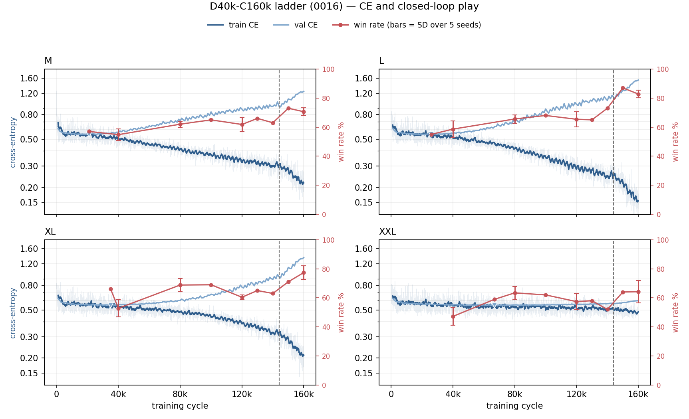

# Can joint data and compute scaling surpass the 89% best checkpoint?

## 1. Goal

The best checkpoint this project has produced is `L-D10k-C40k` final, at **89%** [81.4, 93.7]
on the boss probe from start state `win_level1_20260701015306_i371` (eval
[0016](../../contra_nes_evaluation/doc/0016-c40k-d10k.md)). `XL-D10k-C40k` at 88% and
`M-D10k-C40k` at 86% sit just under it; everything else ever measured is below 73%.

**Can that limit be pushed by scaling data and computation at the same time?** These cells take
4x the episodes (40,000) and 4x the budget (160,000 cycles) — what
[0013](0013-exp-scaling-model.md)'s fourth conclusion called for after
[0014](0014-exp-scaling-compute.md) moved budget alone and [0015](0015-exp-scaling-data.md) moved data
alone, and neither exceeded 89%.

**The decision:** whether more of the same two ingredients still buys play. If the ladder lands
at or below 89%, data and compute are exhausted as levers on this probe, and what remains is the
frozen encoder — 74% of the pre-cache compute, never once unfrozen.

4x data with 4x budget restores **64.0 epochs**, matching D10k-C40k's 64.6, so exposure per
episode is held. But holding epochs moves both ingredients at once, so this is a comparison
against the incumbent, **not** an attribution to either. Separating them needs `D10k-C160k` and
`D40k-C40k`; neither is run.

## 2. Setup

Four cells, one per size, at 4x the data and 4x the budget of `*-D10k-C40k`.

Common to all four: boss-only Spread, batch 16, **160,000 cycles**, LR 3e-4, AdamW, 500 warmup,
WSD with a 10% cooldown (onset step 144,000), bf16, dropout 0.2, `aux_size: 0`,
`value_head: false`, frozen stage-A encoder (`encoder-final.pt`, sha `f36041bc…1923c`), seed 0,
`config_bc_scaling_40k.yaml`. Head dim 64, aspect ratio d/n_layer 128. Checkpoints every 10,000
cycles plus best and final. Run sequentially from `queue/jobs.txt`.

| run | params | d_model | n_layer | ms/step | wall | dir |
|---|---:|---:|---:|---:|---:|---|
| `M-D40k-C160k` | 12.86M | 512 | 4 | 29.5 | 85 min | `runs/scaling40k/M-D40k-C160k` |
| `L-D40k-C160k` | 25.13M | 640 | 5 | 37.6 | 113 min | `runs/scaling40k/L-D40k-C160k` |
| `XL-D40k-C160k` | 42.89M | 768 | 6 | 50.4 | 153 min | `runs/scaling40k/XL-D40k-C160k` |
| `XXL-D40k-C160k` | 101.76M | 1024 | 8 | 101.7 | 405 min | `runs/scaling40k/XXL-D40k-C160k` |

**The data is the new part.** Per data
[0004](../../contra_nes_data/doc/0004-tokenized-datahouse.md) and issue
`kaihe/contra_nes_policy#7`, `contra_nes_data` now owns the encoder and every encoded token.
`src/contra_policy/datahouse.py` reads `game_trace/datahouse/level1/boss/spread/` — 53 shards,
**40,000 episodes / 3,134,341 frames** from `catalog.sqlite`, all from start state
`win_level1_20260701015306_i371` — as zero-copy `mmap` views of byte ranges inside the tars. It
writes nothing; there is no `cache/tokens/*` for this experiment. Before any token is read it
asserts `spec.json` against the running config: encoder sha256, `float16`, width 512,
`goal_then_decision_frames`, `image_size`. The sha is the one every run in 0013–0015 used.

**The validation split is provisional.** No shard is marked val, so `datahouse.split_uids` carves
every 20th uid by sha1 digest: 38,024 train / 1,976 val. Deterministic, but not the fixed split
data 0004 promises — so **CE from these runs is comparable inside this document only**. Win rate
is unaffected: that is one shared start state, not a holdout. With 1,976 val episodes the parent
config's `val_batches: 60` would have scored 960 in-run against 1,976 at the end, so this config
sets `val_batches: 0`.

**Not varied:** seed (0), LR (3e-4, still unswept), schedule (WSD), model shapes.
**Not run:** XS and S; a matched `D40k-C40k` that would separate data from budget. Adding the
datahouse's 40,000 Laser episodes is a different question — a second start state — and is
[0017](0017-exp-scaling-mixed-weapon.md).

## 3. Evaluation metrics

Closed-loop success from eval [0020](../../contra_nes_evaluation/doc/0020-d40k-c160k.md),
`runs/0817-d40k-c160k/<size>-<role>-n100`: n = 100 rollouts, T = 1.0, seed 0, 2x expert budget,
bf16, batch 8, start state `win_level1_20260701015306_i371`, train split, Wilson 95% in brackets.
An **in-distribution / memorization probe** — not a val boss rate, and not to be placed beside
the 57-task mixed-weapon probes (~3–14%) or the specialty val Spread probe (9.5%, eval 0014).

| size | D10k-C40k final (incumbent) | D40k-C160k final |
|---|---|---|
| M | 86% [77.9, 91.5] | 73% [63.6, 80.7] |
| L | **89%** [81.4, 93.7] | 83% [74.5, 89.1] |
| XL | 88% [80.2, 93.0] | 77% [67.8, 84.2] |
| XXL | 59% [49.2, 68.1] | 66% [56.3, 74.5] |

Trajectory. Eval [0022](../../contra_nes_evaluation/doc/0022-d40k-seed-repeat.md) repeated
every step at seeds 1–4, so these are **mean ± SD over 5 seeds** (`runs/0818-d40k-seeds`):

| step | M | L | XL | XXL |
|---|---|---|---|---|
| 40k | 54.8 ± 4.1 | 58.6 ± 5.5 | 52.8 ± 6.0 | 47.2 ± 6.0 |
| 80k | 62.0 ± 2.1 | 65.6 ± 2.9 | 68.8 ± 4.6 | 63.4 ± 4.4 |
| 120k | 61.8 ± 5.1 | 65.4 ± 5.2 | 60.4 ± 1.7 | 57.4 ± 5.5 |
| 160k (final) | **70.6 ± 2.6** | **82.8 ± 2.6** | **77.4 ± 4.6** | **64.2 ± 7.6** |

Between-seed SD is 2–6 pp (XXL final 7.6), below the ~8–10 pp Wilson half-width of any single
probe. 0022 also fills in seed 0 at 100k / 130k / 140k / 150k (`runs/0818-d40k-mid`); those points
are in the figure below.

The three series on one x-axis, one panel per size, from
`python tools/plot_ce_vs_play.py runs/scaling40k doc/figures/0016-ce-vs-play.png --eval
<contra_nes_evaluation>/runs --probe 0817-d40k-c160k --probe 0818-d40k-mid --probe
0818-d40k-seeds --cooldown 144000`. CE on the left log axis — train CE as a 20-point rolling mean
over the faint raw series, val CE whole-set with ▾ at its minimum; win rate on the right linear
axis, red, with SD bars where five seeds exist and none where one does. Dashed line is the WSD
cooldown onset at 144,000. The tool reads eval's `summary.json` files directly, so the figure and
0022 cannot disagree. CE and win rate share no units and no direction: this locates events on a
common x-axis, it is not a correlation. Val CE is the provisional 1-in-20 holdout (§2), and
carries an epoch-locked oscillation of ±0.02–0.03 at a measured period of 2,394 cycles against an
epoch of 2,377 — about one epoch of slop in which step `policy-best.pt` lands on.
`tools/scaling_report.py runs/scaling40k` prints the CE columns as numbers.

## 4. Conclusion

1. Scaling up data and computation makes the thing worse.
2. Weird to see the win rate first rise, then drop, then rise.
3. We suspect the learning rate is too high for large models.
