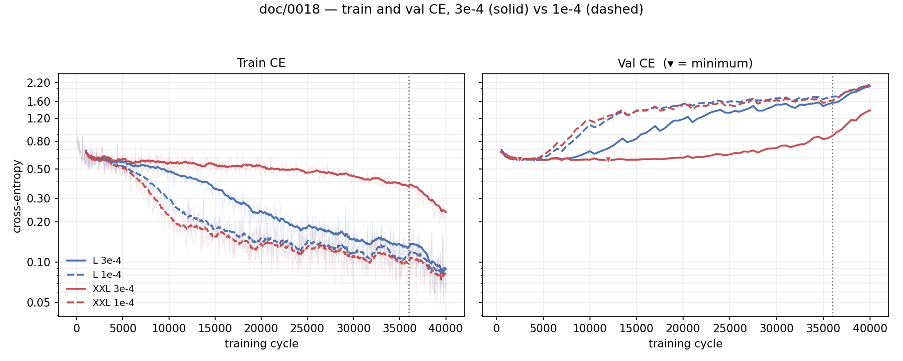

# Does a lower learning rate fix large-model underperformance?

## 1. Goal

Every run from [0013](0013-exp-scaling-model.md) to [0017](0017-exp-scaling-mixed-weapon.md) trained at
**3e-4 at every width**, d_model 512 to 1024, and none of them swept it. The large end behaves as
if that is too high: XXL's train CE stalls at 0.483 where M/L/XL reach 0.15–0.22, and XXL is the
weak play cell at D10k (59%), D20k (61%) and D40k (66%).

**Is 3e-4 too high for the large models?** Optimal LR falls roughly as 1/width, so one value across
a 2x range is mis-set somewhere. If the large cells improve at a lower LR, "no size law" was a
statement about the learning rate and the scaling ladders need re-reading; if they do not, LR is
eliminated and the frozen encoder is the last untried component.

## 2. Setup

The cell is the **D10k tier at 40,000 cycles** — where the anomaly is already visible and where a
run costs 25 min at L. At D10k-C40k, XXL ends at train CE **0.312** against L's **0.090**
([0014](0014-exp-scaling-compute.md) §3); the same gap at D40k needs the full 160,000 cycles to open,
since at 40,000 all four sizes are still within 0.046 of each other (M 0.502 … XXL 0.548).

**The data is the D10k tier, cut from the datahouse as a 13-shard prefix**, not the old
`boss-spread-10k-v1` release on its own token cache. `datahouse.split_uids` carves the holdout by
uid sha1 digest over the whole store *before* the prefix is applied, and the digest does not depend
on shard order — so this cell trains on **9,330 episodes** and validates on the **same 1,976
episodes as every cell in [0016](0016-exp-scaling-joint.md)**. Overlap between the two is 0 by
construction. That is the point of the change: val CE here is comparable to 0016's ladder, which
the release's own 100-episode holdout could never be.

Exposure is **68.6 epochs**, matching D10k-C40k's 64.6 rather than D40k-C160k's 64.0 at four times
the cost.

Two sizes, the ends of the disagreement: **L** (25.13M, d_model 640), which reaches the lowest
train CE and plays best; **XXL** (101.76M, d_model 1024), which stalls and is the weak play cell in
every grid.

Common to all cells: boss-only Spread datahouse tokens, batch 16, 40,000 cycles, AdamW, weight
decay 0.01, 500 warmup, WSD, bf16, dropout 0.2, `aux_size: 0`, `value_head: false`, frozen stage-A
encoder (`encoder-final.pt`, sha `f36041bc…1923c`), seed 0, `config_bc_scaling_lr.yaml`, checkpoints
every 4,000 cycles plus best and final, validation every 500 on the whole holdout
(`val_batches: 0`). Head dim 64, aspect ratio d/n_layer 128.

**The sweep — peak LR**, at the default `decay_frac: 0.1` (cooldown onset 36,000):

| run | size | LR | wall | dir |
|---|---|---:|---:|---|
| `L-D10k-C40k` | L | 3e-4 | 28 min | `runs/scaling_lr/L-D10k-C40k` |
| `L-D10k-C40k-lr1e-4` | L | 1e-4 | 28 min | `runs/scaling_lr/L-D10k-C40k-lr1e-4` |
| `XXL-D10k-C40k` | XXL | 3e-4 | 61 min | `runs/scaling_lr/XXL-D10k-C40k` |
| `XXL-D10k-C40k-lr1e-4` | XXL | 1e-4 | 69 min | `runs/scaling_lr/XXL-D10k-C40k-lr1e-4` |

**4 runs, ~3 h total.** Wall clock is ~15% above `ms/step x steps` because 80 whole-holdout
validations at `val_every: 500` are not in the step timer.

The tier is named **`D10k` for what the model trains on**, not for the store the bytes are read
from: 9,330 episodes is the 10k tier whether it arrives as a release or as 13 of the datahouse's
53 shards. `tools/scaling_report.py` takes that count from the `dataset.json` each run writes,
rather than inferring a size from the config. Note that this makes these cells share names with
[0014](0014-exp-scaling-compute.md)'s `runs/scaling/{L,XXL}-D10k-C40k`: same tier, same budget, but a
different 9.3k episodes on a different holdout. The `dir` column is what separates them, and it is
why the 3e-4 arms are **run here rather than reused** — `runs/scaling/{L,XXL}-D10k-C40k` is a
different episode set on a different holdout, so it can serve §1's motivation but not as this
sweep's control.

A 1/width rule anchored at 3e-4 for M (d=512) puts L at 2.4e-4 and XXL at 1.5e-4, so 1e-4 sits
below both — one point in the hypothesised direction, not a bracket. Running it at **both** sizes
is what makes this a test of *width-dependence*, and it is the whole design: if 1e-4 helps XXL and
hurts L, the LR is mis-scaled with width; if it moves both the same way, the problem is the LR, not
the ladder; if it moves neither, LR is eliminated.

**A confound this sweep does not separate.** The optimizer is
`AdamW(params, lr=…, weight_decay=0.01)` — one param group, decoupled decay — so weights shrink by
`lr x weight_decay` per step and the 3e-4 arm is regularised **3x harder**: 11.3% shrinkage over
40,000 steps against 3.9% at 1e-4. Lower LR therefore means both smaller steps and weaker decay,
and §3's train CE cannot attribute the difference to one of them. Holding `lr x wd` fixed needs a
1e-4 arm at `weight_decay: 0.03` — 2 runs, ~1 h 40, not run.

**Not varied:** data (the 13-shard prefix), budget (C40k), schedule family (WSD), `decay_frac`
(0.1), weight decay (0.01 nominal — but see the confound above), batch, dropout, warmup, seed (0), model shapes. **Not run:** a `decay_frac: 0.5` arm, which
would hold the peak and lengthen the anneal and is the only thing that separates *lower LR overall*
from *more time at low LR* — 2 runs and ~1 h 33 if the peak sweep makes it worth asking; an LR
*above* 3e-4, since the hypothesis is directional;
M and XL, worth ~2 h only if L and XXL disagree; muP, which stays rejected until this sweep says
width-dependent LR matters; a second training seed per arm, which matters less than the 5-seed eval
means §3 will need — with between-seed SD of 2–6 pp
([0022](../../contra_nes_evaluation/doc/0022-d40k-seed-repeat.md)), a single probe cannot resolve
anything under ~8 pp.

## 3. Evaluation metrics

Cross-entropy from `tools/scaling_report.py runs/scaling_lr`, on the 1,976-episode holdout of
§2 — the same episodes as [0016](0016-exp-scaling-joint.md), and comparable to it. Closed-loop play
is not yet requested.

**Finals.** All four cells complete.

| cell | LR | train CE | val CE best | @step | val CE final |
|---|---|---:|---:|---:|---:|
| `L-D10k-C40k` | 3e-4 | 0.0880 | 0.5798 | 4,000 | 2.0708 |
| `L-D10k-C40k-lr1e-4` | 1e-4 | 0.0860 | 0.5788 | 2,500 | 2.1290 |
| `XXL-D10k-C40k` | 3e-4 | 0.2366 | 0.5803 | 12,000 | 1.3675 |
| `XXL-D10k-C40k-lr1e-4` | 1e-4 | 0.0807 | 0.5835 | 2,500 | 2.1045 |

**Closed-loop success**, from eval
[0023](../../contra_nes_evaluation/doc/0023-lr-sweep.md), `runs/0818-lr-sweep/*-s0-n100`:
n = 100, T = 1.0, **seed 0 only**, 2x expert budget, bf16, batch 8, start
`win_level1_20260701015306_i371`, train split, Wilson 95% in brackets. An **in-distribution /
memorization probe**, and on a different 9,330-episode tier than
[0016](0016-exp-scaling-joint.md)'s incumbent, so it is not a like-for-like extension of that table.

| cell | 12k | 24k | 36k | **40k final** |
|---|---|---|---|---|
| L 3e-4 | 54% [44.3, 63.4] | 68% [58.3, 76.3] | 74% [64.6, 81.6] | **88%** [80.2, 93.0] |
| L 1e-4 | 70% [60.4, 78.1] | 82% [73.3, 88.3] | 82% [73.3, 88.3] | **90%** [82.6, 94.5] |
| XXL 3e-4 | 58% [48.2, 67.2] | 54% [44.3, 63.4] | 59% [49.2, 68.1] | **65%** [55.3, 73.6] |
| XXL 1e-4 | 57% [47.2, 66.3] | 76% [66.8, 83.3] | 81% [72.2, 87.5] | **97%** [91.5, 99.0] |

`policy-best.pt` plays worse in every cell (L 47 / 40%, XXL 58 / 50%), as in 0016 and 0020.
Cooldown onset is 36,000, so the 36k column is the last pre-anneal point. Between-seed SD was
2–6 pp in eval [0022](../../contra_nes_evaluation/doc/0022-d40k-seed-repeat.md); these are one
seed each, so L's 90 against 88 is inside that band and XXL's 97 against 65 is far outside it.

**Train CE at matched exposure**, L, from `metrics.csv` averaged over ±1.5 epochs:

| epoch | 3e-4 | 1e-4 |
|---:|---:|---:|
| 10 | 0.5290 | 0.4689 |
| 20 | 0.4325 | 0.2232 |
| 30 | 0.2734 | 0.1572 |
| 40 | 0.1817 | 0.1279 |
| 68 | 0.0878 | 0.0845 |

The four cells, from `python tools/plot_ce_cells.py doc/figures/0018-ce.png --x cycles --pair
--cooldown 36000 --cell "<label>=<run_dir>" …`. Colour is size, dash is 1e-4. X is the training
cycle, which is comparable here only because all four share one data tier at 68.6 epochs; log y.
Train CE is a 20-point rolling mean over the faint raw series, val CE is whole-set with ▾ at its
minimum, and the dotted line is the WSD cooldown onset at 36,000.

## 4. Conclusion

1. 1e-4 is a much better learning rate.
2. Since train CE drops further and faster during the annealing phase of WSD, it is worth
   exploring lower learning rates.
