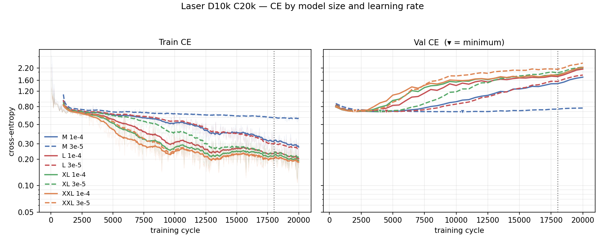

# How does model size affect Laser boss play at low learning rates?

## 1. Goal

[0018](0018-exp-learning-rate.md) raised XXL's Spread-start success from 65% to **97%** by lowering
the learning rate from 3e-4 to 1e-4. [0017](0017-exp-scaling-mixed-weapon.md) showed that M and L can
learn from Laser traces, but its mixed D80k cells reached only 23% and 30% on the Laser start.

**How do model size and a further LR reduction affect Laser boss-fight success when trained only
on Laser traces, and can XXL win at a high rate?** This decides whether the 0018 result generalises
across the two winnable weapon/start-state distributions, whether 1e-4 is already low enough, or
whether the gains seen during its cooldown continue at 3e-5.

## 2. Setup

Four model sizes crossed with two low learning rates, matching 0018's D10k exposure recipe while
changing the data from Spread to Laser. The Laser store has 70 shards, so its D10k prefix is its
first 18 shards: **9,771 train
episodes / 1,020,299 frames** after the uid-digest holdout, rather than copying Spread's 13-shard
boundary. The full Laser store supplies the fixed **1,993-episode** validation set; train/val
overlap is zero.

Common setup: Laser-only level-1 boss datahouse tokens, batch 32, 20,000 cycles (**65.5 epochs**),
AdamW, weight decay 0.01, 500 warmup, WSD with 10% cooldown, bf16, dropout 0.2,
`aux_size: 0`, `value_head: false`, frozen stage-A encoder (`encoder-final.pt`, sha
`f36041bc…1923c`), seed 0, `config_bc_laser.yaml`, validation every 500 on the whole
holdout, checkpoints every 2,000 cycles plus best and final.

| run | params | d_model | n_layer | LR | data | cycles | state | dir |
|---|---:|---:|---:|---:|---:|---:|---|---|
| `M-D10k-C20k-laser-lr1e-4` | 12.86M | 512 | 4 | 1e-4 | 9,771 | 20,000 | done, 12 min | `runs/laser/M-D10k-C20k-laser-lr1e-4` |
| `L-D10k-C20k-laser-lr1e-4` | 25.13M | 640 | 5 | 1e-4 | 9,771 | 20,000 | done, 18 min | `runs/laser/L-D10k-C20k-laser-lr1e-4` |
| `XL-D10k-C20k-laser-lr1e-4` | 42.89M | 768 | 6 | 1e-4 | 9,771 | 20,000 | done, 22 min | `runs/laser/XL-D10k-C20k-laser-lr1e-4` |
| `XXL-D10k-C20k-laser-lr1e-4` | 101.76M | 1024 | 8 | 1e-4 | 9,771 | 20,000 | done, 40 min | `runs/laser/XXL-D10k-C20k-laser-lr1e-4` |
| `M-D10k-C20k-laser-lr3e-5` | 12.86M | 512 | 4 | 3e-5 | 9,771 | 20,000 | done, 13 min | `runs/laser/M-D10k-C20k-laser-lr3e-5` |
| `L-D10k-C20k-laser-lr3e-5` | 25.13M | 640 | 5 | 3e-5 | 9,771 | 20,000 | done, 17 min | `runs/laser/L-D10k-C20k-laser-lr3e-5` |
| `XL-D10k-C20k-laser-lr3e-5` | 42.89M | 768 | 6 | 3e-5 | 9,771 | 20,000 | done, 21 min | `runs/laser/XL-D10k-C20k-laser-lr3e-5` |
| `XXL-D10k-C20k-laser-lr3e-5` | 101.76M | 1024 | 8 | 3e-5 | 9,771 | 20,000 | done, 48 min | `runs/laser/XXL-D10k-C20k-laser-lr3e-5` |

The closed-loop target is the Laser start
`win_level1_20260630171218_i8`, matching the training traces and 0017's Laser probe. This is an
in-distribution / memorization probe, not evidence of transfer to unseen starts. No Spread arm,
3e-4 control or second training seed is run: 0018 supplies the size/LR motivation and 0017 supplies
the existing mixed-data M/L Laser reference, but neither is a matched control because its data
mixture differs. The M/L/XL cells determine whether any high Laser rate is specific to XXL or part
of a size trend.

## 3. Evaluation metrics

Cross-entropy will come from
`python tools/scaling_report.py runs/laser` on the 1,993-episode Laser holdout.

| cell | LR | train CE | val CE best | @step | val CE final | source |
|---|---:|---:|---:|---:|---:|---|
| M | 1e-4 | 0.2770 | 0.6989 | 4,000 | 1.7369 | `tools/scaling_report.py runs/laser` |
| M | 3e-5 | 0.5850 | 0.6998 | 10,500 | 0.7707 | same |
| L | 1e-4 | 0.2029 | 0.7009 | 2,000 | 2.1465 | same |
| L | 3e-5 | 0.2636 | 0.7023 | 4,500 | 1.8351 | same |
| XL | 1e-4 | 0.1922 | 0.7027 | 2,000 | 2.2246 | same |
| XL | 3e-5 | 0.2092 | 0.7035 | 4,000 | 2.2641 | same |
| XXL | 1e-4 | 0.1854 | 0.7054 | 2,000 | 2.2537 | same |
| XXL | 3e-5 | 0.1875 | 0.7072 | 2,000 | 2.5146 | same |

From `python tools/plot_ce_cells.py doc/figures/0020-ce.png --x cycles --pair --cooldown
18000 --cell "<label>=<run_dir>" …`. Colour is model size; solid is 1e-4 and dashed is 3e-5.
Train CE is a 20-point rolling mean over the faint raw series, validation uses the full
1,993-episode holdout, ▾ marks its minimum, and the dotted line is WSD cooldown onset.

Closed-loop Laser-start success from evaluation
[0024](../../contra_nes_evaluation/doc/0024-laser-size-lr.md),
`runs/0819-laser-lr/*`: n = 100, T = 1.0, seed 0, 2x expert budget, bf16, batch 8,
`full_laser.state`, Wilson 95% in brackets. This is an **in-distribution / memorization probe**,
not held-out or cross-start generalisation.

| cell / LR | final success [Wilson 95%] |
|---|---:|
| M / 1e-4 | 18% [11.7, 26.7] |
| M / 3e-5 | 26% [18.4, 35.4] |
| L / 1e-4 | 19% [12.5, 27.8] |
| L / 3e-5 | 13% [7.8, 21.0] |
| XL / 1e-4 | 16% [10.1, 24.4] |
| XL / 3e-5 | 17% [10.9, 25.5] |
| XXL / 1e-4 | 17% [10.9, 25.5] |
| XXL / 3e-5 | 11% [6.3, 18.6] |

## 4. Conclusion

1. 1e-4 is the current winning learning rate.
2. We knew the Laser-gun fight was harder, but why can the GPT policy memorize Spread-gun traces
   while failing to remember Laser traces?
