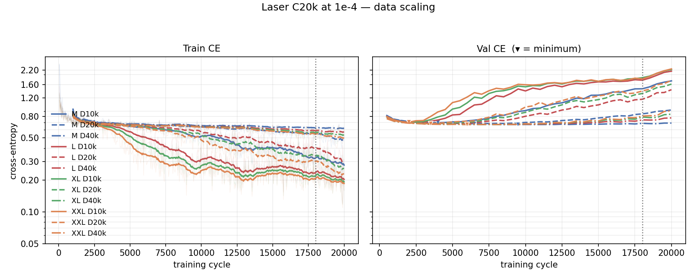

# Does more Laser data improve boss play at fixed compute?

## 1. Goal

[0020](0020-exp-laser-model-scaling.md) found only 11–26% Laser-start success across four model sizes
and two low learning rates, while the same GPT family memorized Spread much more successfully.
Its D10k cells cannot distinguish insufficient Laser coverage from a harder imitation problem.

**Does scaling Laser-only training data from D10k through D20k to D40k improve closed-loop
success at the same C20k budget and selected 1e-4 learning rate?** This complete fixed-compute
data axis decides whether broader Laser trace coverage helps on the current recipe.

## 2. Setup

Four model sizes crossed with three nested Laser data tiers. The uid-digest holdout is carved from
the full 70-shard store before each prefix is applied, so every cell uses the same **1,993 validation
episodes** and train/val overlap is zero.

| tier | shards | train episodes | train frames | epochs at C20k |
|---|---:|---:|---:|---:|
| D10k | 18 / 70 | 9,771 | 1,020,299 | 65.5 |
| D20k | 36 / 70 | 19,496 | 2,037,352 | 32.8 |
| D40k | 70 / 70 | 38,007 | 3,971,770 | 16.8 |

Common to all cells: Laser-only level-1 boss datahouse tokens, batch 32, 20,000 cycles, AdamW,
LR **1e-4**, weight decay 0.01, 500 warmup, WSD with 10% cooldown, bf16, dropout 0.2,
`aux_size: 0`, `value_head: false`, frozen stage-A encoder (`encoder-final.pt`, sha
`f36041bc…1923c`), seed 0, validation every 500 on the whole holdout, checkpoints every 2,000
cycles plus best and final.

| run | params | data | state | dir |
|---|---:|---:|---|---|
| `M-D10k-C20k-laser-lr1e-4` | 12.86M | 9,771 | done, 12 min | `runs/laser/M-D10k-C20k-laser-lr1e-4` |
| `L-D10k-C20k-laser-lr1e-4` | 25.13M | 9,771 | done, 18 min | `runs/laser/L-D10k-C20k-laser-lr1e-4` |
| `XL-D10k-C20k-laser-lr1e-4` | 42.89M | 9,771 | done, 22 min | `runs/laser/XL-D10k-C20k-laser-lr1e-4` |
| `XXL-D10k-C20k-laser-lr1e-4` | 101.76M | 9,771 | done, 40 min | `runs/laser/XXL-D10k-C20k-laser-lr1e-4` |
| `M-D20k-C20k-laser-lr1e-4` | 12.86M | 19,496 | done, 10 min | `runs/laser20k/M-D20k-C20k-laser-lr1e-4` |
| `L-D20k-C20k-laser-lr1e-4` | 25.13M | 19,496 | done, 16 min | `runs/laser20k/L-D20k-C20k-laser-lr1e-4` |
| `XL-D20k-C20k-laser-lr1e-4` | 42.89M | 19,496 | done, 21 min | `runs/laser20k/XL-D20k-C20k-laser-lr1e-4` |
| `XXL-D20k-C20k-laser-lr1e-4` | 101.76M | 19,496 | done, 43 min | `runs/laser20k/XXL-D20k-C20k-laser-lr1e-4` |
| `M-D40k-C20k-laser-lr1e-4` | 12.86M | 38,007 | done, 12 min | `runs/laser40k/M-D40k-C20k-laser-lr1e-4` |
| `L-D40k-C20k-laser-lr1e-4` | 25.13M | 38,007 | done, 18 min | `runs/laser40k/L-D40k-C20k-laser-lr1e-4` |
| `XL-D40k-C20k-laser-lr1e-4` | 42.89M | 38,007 | done, 23 min | `runs/laser40k/XL-D40k-C20k-laser-lr1e-4` |
| `XXL-D40k-C20k-laser-lr1e-4` | 101.76M | 38,007 | done, 42 min | `runs/laser40k/XXL-D40k-C20k-laser-lr1e-4` |

The fixed C20k budget halves exposure at each data doubling, so this axis changes both distinct
data and repetition; it does not isolate either mechanism. Not varied: LR, budget, seed, model
shapes, schedule, batch, dropout, encoder or validation set. Not run: exposure-matched D20k/C40k
or D40k/C80k cells.

## 3. Evaluation metrics

Cross-entropy from `python tools/scaling_report.py runs/{laser,laser20k,laser40k}` on the shared
1,993-episode Laser holdout.

| size | tier | train CE | val CE best | @step | val CE final | source |
|---|---|---:|---:|---:|---:|---|
| M | D10k | 0.2770 | 0.6989 | 4,000 | 1.7369 | `tools/scaling_report.py runs/laser` |
| M | D20k | 0.4832 | 0.6825 | 6,500 | 0.9215 | `tools/scaling_report.py runs/laser20k` |
| M | D40k | 0.6172 | 0.6701 | 9,500 | 0.6921 | `tools/scaling_report.py runs/laser40k` |
| L | D10k | 0.2029 | 0.7009 | 2,000 | 2.1465 | `tools/scaling_report.py runs/laser` |
| L | D20k | 0.3067 | 0.6825 | 3,500 | 1.4335 | `tools/scaling_report.py runs/laser20k` |
| L | D40k | 0.5696 | 0.6701 | 6,000 | 0.7750 | `tools/scaling_report.py runs/laser40k` |
| XL | D10k | 0.1922 | 0.7027 | 2,000 | 2.2246 | `tools/scaling_report.py runs/laser` |
| XL | D20k | 0.2574 | 0.6821 | 3,500 | 1.6200 | `tools/scaling_report.py runs/laser20k` |
| XL | D40k | 0.5344 | 0.6697 | 6,000 | 0.8411 | `tools/scaling_report.py runs/laser40k` |
| XXL | D10k | 0.1854 | 0.7054 | 2,000 | 2.2537 | `tools/scaling_report.py runs/laser` |
| XXL | D20k | 0.2288 | 0.6821 | 3,500 | 1.7568 | `tools/scaling_report.py runs/laser20k` |
| XXL | D40k | 0.5015 | 0.6693 | 6,000 | 0.9033 | `tools/scaling_report.py runs/laser40k` |

From `python tools/plot_ce_cells.py doc/figures/0021-ce.png --x cycles --group-size 3
--cooldown 18000 --cell "<label>=<run_dir>" …`. Colour is model size; solid / dashed / dash-dot
are D10k / D20k / D40k. Train CE is a 20-point rolling mean over the faint raw series,
validation uses the shared full holdout, ▾ marks its minimum, and the dotted line is WSD cooldown.

Closed-loop Laser-start success from evaluation
[0024](../../contra_nes_evaluation/doc/0024-laser-size-lr.md),
[0025](../../contra_nes_evaluation/doc/0025-laser-d20k.md) and
[0026](../../contra_nes_evaluation/doc/0026-laser-d40k.md): n = 100, T = 1.0, seed 0, 2x expert
budget, bf16, batch 8, `full_laser.state`, Wilson 95% in brackets. These are
**in-distribution / memorization probes**, not validation rates.

| size | D10k final | D20k final | D40k final |
|---|---:|---:|---:|
| M | 18% [11.7, 26.7] | 30% [21.9, 39.6] | 35% [26.4, 44.7] |
| L | 19% [12.5, 27.8] | 25% [17.5, 34.3] | 29% [21.0, 38.5] |
| XL | 16% [10.1, 24.4] | 22% [15.0, 31.1] | 30% [21.9, 39.6] |
| XXL | 17% [10.9, 25.5] | 27% [19.4, 36.4] | 35% [26.4, 44.7] |

## 4. Conclusion

1. More training data is useful for improving difficult games such as the Laser-gun fight.
2. The Laser gun has a much lower win rate than the Spread gun and is much harder to improve.
